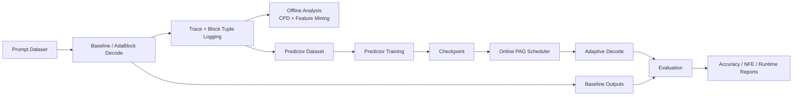
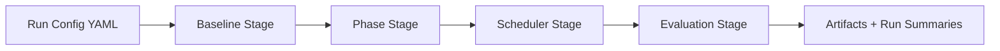

# Phase-Adaptive Generation (PAG)

Phase-Adaptive Generation (PAG) is a research codebase for **adaptive compute scheduling in diffusion language models**. It combines:

- a structured `src/pag` 4-stage pipeline (baseline → phase analysis → scheduler → evaluation),
- a production-style AdaBlock/LLaDA integration for online adaptive decoding,
- an offline phase-change and trace analysis toolkit with a Streamlit UI,
- predictor training/evaluation tooling for next block-size + refinement-budget control.

For project details, method rationale, and full results, see `writeup/final_report.pdf`.

---

## Repository map

- `src/pag/`: typed, modular orchestration pipeline (contracts + stages + CLI).
- `AdaBlock-dLLM/`: LLaDA and Dream integration with PAG/AdaBlock/baseline decode harnesses.
- `phase_predict/`: block-tuple dataset, model, train, and inference code.
- `phase_cpd/`: trace loading, feature extraction, CPD segmentation, plotting, and UI app.
- `scripts/`: convenience scripts to run stages and experiments.
- `tests/`: unit and integration tests across PAG, LLaDA/Dream glue, phase prediction, and CPD.
- `writeup/`: final report, figures, and experiment summary tables.

---

## End-to-end workflow



### `src/pag` stage workflow



---

## Setup

## 1) Environment

```bash
uv sync
```

This creates `.venv/` and installs dependencies from `pyproject.toml` / `uv.lock`.

## 2) Optional: install AdaBlock-dLLM dependencies

If you are running experiments under `AdaBlock-dLLM/`, also install:

```bash
uv pip install -r AdaBlock-dLLM/requirements.txt
```

---

## How to run each part of the codebase

## A) Structured PAG pipeline (`src/pag`)

Run one mock adaptive pipeline pass:

```bash
uv run python scripts/run_pipeline.py --config configs/runs/adaptive_mock.yaml
```

Run baseline-only mock config:

```bash
uv run python scripts/run_pipeline.py --config configs/runs/baseline_mock.yaml
```

You can also invoke the package CLI:

```bash
uv run python -m pag --config configs/runs/adaptive_mock.yaml
```

## B) Individual stage scripts

Baseline stage:

```bash
uv run python scripts/run_baseline.py --config configs/runs/baseline_mock.yaml
```

Phase analysis stage:

```bash
uv run python scripts/run_phase_analysis.py --config configs/runs/adaptive_mock.yaml
```

Adaptive scheduling stage:

```bash
uv run python scripts/run_adaptive.py --config configs/runs/adaptive_mock.yaml
```

Evaluation utility:

```bash
uv run python scripts/evaluate_runs.py --help
```

## C) Predictor training + evaluation (`phase_predict/`)

Train predictor:

```bash
uv run python scripts/train_phase_predict.py --help
```

Build/inspect tuple dataset:

```bash
uv run python scripts/build_predictor_dataset.py --help
```

Quick predictor sanity test:

```bash
uv run python scripts/run_phase_predict_test.py --help
```

## D) AdaBlock / LLaDA / Dream experiments (`AdaBlock-dLLM/`)

LLaDA evaluation scripts:

```bash
uv run python AdaBlock-dLLM/llada/eval_llada_baseline.py --help
uv run python AdaBlock-dLLM/llada/eval_llada_adablock.py --help
uv run python AdaBlock-dLLM/llada/eval_llada_pag.py --help
```

Dream evaluation scripts:

```bash
uv run python AdaBlock-dLLM/dream/eval_dream.py --help
uv run python AdaBlock-dLLM/dream/eval_dream_adablock.py --help
uv run python AdaBlock-dLLM/dream/eval_dream_pag.py --help
```

Compare PAG vs AdaBlock logs:

```bash
uv run python scripts/view_llada_pag_vs_adablock.py --help
uv run python AdaBlock-dLLM/llada/run_pag_vs_adablock_eval.py --help
```

## E) CPD analysis + UI (`phase_cpd/`)

Run CPD/feature report script:

```bash
uv run python phase_cpd/report_trace_profiles.py --help
```

Export scheduler-style dataset from traces:

```bash
uv run python phase_cpd/export_scheduler_dataset.py --help
```

Launch Streamlit UI:

```bash
uv run streamlit run phase_cpd/app.py
```

The UI is for browsing trace profiles, segment boundaries, and feature-derived phase behavior.

---

## Results snapshot (from `writeup/final_report.pdf`)

On the final GSM8K holdout comparison (200 prompts), PAG reports:

- **Accuracy parity** with AdaBlock at **89.5%**.
- **Lower average total NFE**: from AdaBlock `34.63` to PAG `27.22` (**~21.4% reduction**).
- **Small scheduler overhead**: about **3.38 ms per prompt**.
- **Net runtime improvement** vs vanilla AdaBlock: approximately **5 ms faster on average**.

### Visual results included in this repo

- CPD/token-stability visualizations:
  - `phase_cpd/results_pelt/pelt_images/algebra_images/*`
  - `phase_cpd/results_pelt/pelt_images/binary_search_images/*`
- Report figures and tables:
  - `writeup/figs/nfe.png`
  - `writeup/figs/confidence_vs_nfe.png`
  - `writeup/figs/final_eval_summary.tex`
  - `writeup/figs/final_eval_points.tsv`

---

## Artifact structure

Pipeline artifacts are written under `artifacts/<run_id>/` by stage:

- `baseline/requests.jsonl`
- `baseline/traces.jsonl`
- `baseline/token_signals.jsonl`
- `baseline/completions.jsonl`
- `baseline/run_summary.json`
- `phases/phase_annotations.jsonl`
- `phases/predictor_dataset.jsonl`
- `phases/predictions.jsonl`
- `phases/predictor_metadata.json`
- `phases/run_summary.json`
- `scheduler/schedule_decisions.jsonl`
- `scheduler/schedule_plans.jsonl`
- `scheduler/adaptive_results.jsonl`
- `scheduler/comparison_metrics.json`
- `scheduler/run_summary.json`
- `evaluation/records.jsonl`
- `evaluation/run_summary.json`

---

## Testing

Run full test suite:

```bash
make test
```

Or run subsets:

```bash
uv run pytest tests/integration -q
uv run pytest tests/phase_predict -q
uv run pytest tests/phase_cpd -q
uv run pytest tests/llada -q
uv run pytest tests/dream -q
```

---

## Additional docs

- `docs/architecture.md`
- `docs/module_contracts.md`
- `docs/module_io_contracts.md`
- `docs/workflow_diagram.md`
- `docs/testing_guide.md`
- `docs/teammate_workflow.md`
