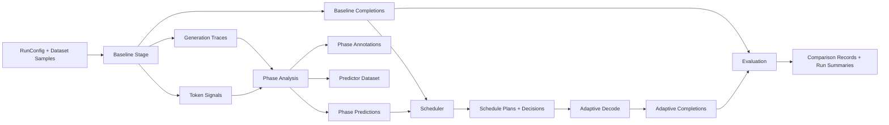

# Phase-Adaptive Generation (PAG)

PAG is a research codebase for studying phase-adaptive decoding in diffusion language models. The project is organized around a simple pipeline: baseline fixed decoding, trace and signal analysis, phase prediction, adaptive scheduling, and evaluation.

## Design goals

- Keep module boundaries explicit and small.
- Share data through typed artifacts rather than inheritance-heavy services.
- Allow each team to evolve its own package without touching orchestration or breaking stage handoffs.
- Make test subsets runnable per teammate.

## Public stage entrypoints

- `pag.baselines.run_baseline(...)`
- `pag.phases.run_phase_analysis(...)`
- `pag.scheduler.run_adaptive_decoding(...)`
- `pag.evaluation.evaluate_runs(...)`

These are the only hard code-level boundaries the project enforces. Teams are free to use functions, classes, or other internal structure behind them.

## Workflow



The workflow is stage-based:

- The baseline stage runs fixed decoding and produces traces, token-level signals, and baseline completions.
- The phase stage consumes those traces and signals to build annotations, predictor-ready items, and phase predictions.
- The scheduler stage combines baseline outputs with phase predictions to decide chunk sizes and refinement intensity for adaptive decoding.
- The evaluation stage compares baseline and adaptive outputs and writes comparison-ready records and summaries.

## Quick start

```bash
uv sync
uv run python scripts/run_pipeline.py --config configs/runs/adaptive_mock.yaml
make test
```

`uv sync` creates the project-local virtual environment at `.venv/` and installs the default `dev`
dependency group automatically.

## Repo layout

- `src/pag/contracts`: shared dataclasses, typing protocols, serialization helpers
- `src/pag/baselines`: baseline stage entrypoint and implementation
- `src/pag/phases`: phase analysis stage entrypoint and implementation
- `src/pag/scheduler`: adaptive scheduling stage entrypoint and implementation
- `src/pag/evaluation`: comparison and evaluation entrypoint and implementation
- `src/pag/orchestration`: pipeline wiring and CLI
- `src/pag/config`: YAML config loading and artifact path helpers
- `src/pag/utils`: artifact persistence helpers and run/request ids
- `configs`: example YAML configs for runs, model, decoding, predictor, scheduler, evaluation, dataset
- `tests`: contract, stage, and end-to-end wiring tests
- `docs`: architecture and teammate workflow documentation

## Artifact layout

Artifacts are written under `artifacts/<run_id>/` by stage:

- `baseline/requests.jsonl`
- `baseline/traces.jsonl`
- `baseline/token_signals.jsonl`
- `baseline/completions.jsonl`
- `baseline/run_summary.json`
- `phases/phase_annotations.jsonl`
- `phases/predictor_dataset.jsonl`
- `phases/predictions.jsonl`
- `phases/predictor_metadata.json`
- `phases/run_summary.json`
- `scheduler/schedule_decisions.jsonl`
- `scheduler/schedule_plans.jsonl`
- `scheduler/adaptive_results.jsonl`
- `scheduler/comparison_metrics.json`
- `scheduler/run_summary.json`
- `evaluation/records.jsonl`
- `evaluation/run_summary.json`

## Team ownership

- Baselines / adapters / inference / eval: `src/pag/baselines`, `src/pag/evaluation`
- Phase analysis / signals / predictor: `src/pag/phases`
- Scheduler / adaptive decode / orchestration policy: `src/pag/scheduler`

The orchestration layer only wires stage outputs into stage inputs. It should stay thin.
