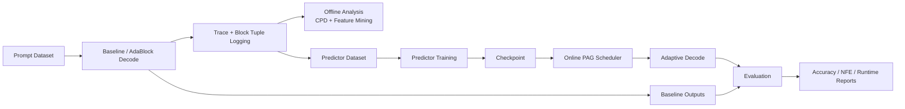
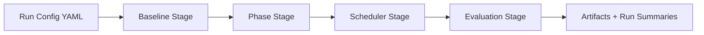

# Phase-Adaptive Generation (PAG)

Phase-Adaptive Generation (PAG) is a research codebase for **adaptive compute scheduling in diffusion language models**. It combines:

- a structured `src/pag` 4-stage pipeline (baseline → phase analysis → scheduler → evaluation),
- a production-style AdaBlock/LLaDA integration for online adaptive decoding,
- an offline phase-change and trace analysis toolkit with a Streamlit UI,
- predictor training/evaluation tooling for next block-size + refinement-budget control.

The current workshop track is **Risk-Calibrated PAG (RC-PAG)**: finite-sample control of
premature block commitment with a one-A100, claim-gated evaluation. Start with the
[one-command v8 guide](docs/rc_pag_one_command.md), the
[mathematical workshop draft](writeup/rc_pag_workshop.tex), and the
[literature positioning](docs/literature/2026-07-29-rc-pag-positioning.md). The earlier project
report remains at `writeup/final_report.pdf` as historical context, not current evidence.
The v8 launcher automatically downloads only missing pinned Hugging Face assets, verifies the
cache, and then executes the resumable experiment offline.

---

## Repository map

- `src/pag/`: typed, modular orchestration pipeline (contracts + stages + CLI).
- `AdaBlock-dLLM/`: LLaDA and Dream integration with PAG/AdaBlock/baseline decode harnesses.
- `phase_predict/`: block-tuple dataset, model, train, and inference code.
- `phase_cpd/`: trace loading, feature extraction, CPD segmentation, plotting, and UI app.
- `scripts/`: convenience scripts to run stages and experiments.
- `tests/`: unit and integration tests across PAG, LLaDA/Dream glue, phase prediction, and CPD.
- `writeup/`: final report, figures, and experiment summary tables.

---

## End-to-end workflow


```mermaid
flowchart LR
    A[Prompt Dataset] --> B[Baseline / AdaBlock Decode]
    B --> C[Trace + Block Tuple Logging]
    C --> D[Offline Analysis
CPD + Feature Mining]
    C --> E[Predictor Dataset]
    E --> F[Predictor Training]
    F --> G[Checkpoint]
    G --> H[Online PAG Scheduler]
    H --> I[Adaptive Decode]
    B --> J[Baseline Outputs]
    I --> K[Evaluation]
    J --> K
    K --> L[Accuracy / NFE / Runtime Reports]
```

### `src/pag` stage workflow


```mermaid
flowchart LR
    C0[Run Config YAML] --> C1[Baseline Stage]
    C1 --> C2[Phase Stage]
    C2 --> C3[Scheduler Stage]
    C3 --> C4[Evaluation Stage]
    C4 --> C5[Artifacts + Run Summaries]
```

---

## Setup

## 1) Environment

```bash
uv sync
```

This creates `.venv/` and installs dependencies from `pyproject.toml` / `uv.lock`.

## 2) Optional: install AdaBlock-dLLM dependencies

If you are running experiments under `AdaBlock-dLLM/`, also install:

```bash
uv pip install -r AdaBlock-dLLM/requirements.txt
```

---

## How to run each part of the codebase

## A) Structured PAG pipeline (`src/pag`)

Run one mock adaptive pipeline pass:

```bash
uv run python scripts/run_pipeline.py --config configs/runs/adaptive_mock.yaml
```

Run baseline-only mock config:

```bash
uv run python scripts/run_pipeline.py --config configs/runs/baseline_mock.yaml
```

You can also invoke the package CLI:

```bash
uv run python -m pag --config configs/runs/adaptive_mock.yaml
```

## B) Individual stage scripts

Baseline stage:

```bash
uv run python scripts/run_baseline.py --config configs/runs/baseline_mock.yaml
```

Phase analysis stage:

```bash
uv run python scripts/run_phase_analysis.py --config configs/runs/adaptive_mock.yaml
```

Adaptive scheduling stage:

```bash
uv run python scripts/run_adaptive.py --config configs/runs/adaptive_mock.yaml
```

Evaluation utility:

```bash
uv run python scripts/evaluate_runs.py --help
```

## C) Predictor training + evaluation (`phase_predict/`)

Train predictor:

```bash
uv run python scripts/train_phase_predict.py --help
```

Build/inspect tuple dataset:

```bash
uv run python scripts/build_predictor_dataset.py --help
```

Quick predictor sanity test:

```bash
uv run python scripts/run_phase_predict_test.py --help
```

## D) AdaBlock / LLaDA / Dream experiments (`AdaBlock-dLLM/`)

LLaDA evaluation scripts:

```bash
uv run python AdaBlock-dLLM/llada/eval_llada_baseline.py --help
uv run python AdaBlock-dLLM/llada/eval_llada_adablock.py --help
uv run python AdaBlock-dLLM/llada/eval_llada_pag.py --help
```

Dream evaluation scripts:

```bash
uv run python AdaBlock-dLLM/dream/eval_dream.py --help
uv run python AdaBlock-dLLM/dream/eval_dream_adablock.py --help
uv run python AdaBlock-dLLM/dream/eval_dream_pag.py --help
```

Compare PAG vs AdaBlock logs:

```bash
uv run python scripts/view_llada_pag_vs_adablock.py --help
uv run python AdaBlock-dLLM/llada/run_pag_vs_adablock_eval.py --help
```

## E) CPD analysis + UI (`phase_cpd/`)

Run CPD/feature report script:

```bash
uv run python phase_cpd/report_trace_profiles.py --help
```

Export scheduler-style dataset from traces:

```bash
uv run python phase_cpd/export_scheduler_dataset.py --help
```

Launch Streamlit UI:

```bash
uv run streamlit run phase_cpd/app.py
```

The UI is for browsing trace profiles, segment boundaries, and feature-derived phase behavior.

---

## Audited results snapshot

Corrected accounting counts every initial proposal forward pass. On GSM8K, PAG reaches 76.19%
accuracy vs 77.79% for AdaBlock and uses 4.0% fewer NFEs. On MATH-500, PAG reaches 36.67% vs
38.00% and uses 6.7% fewer NFEs. `size_lookup` slightly dominates PAG on GSM8K; this motivates the
risk-controlled residual experiment below. See the run's `report_regraded/` directory.

### Visual results included in this repo

- CPD/token-stability visualizations:
  - `phase_cpd/results_pelt/pelt_images/algebra_images/*`
  - `phase_cpd/results_pelt/pelt_images/binary_search_images/*`
- Report figures and tables:
  - `writeup/figs/nfe.png`
  - `writeup/figs/confidence_vs_nfe.png`
  - `writeup/figs/final_eval_summary.tex`
  - `writeup/figs/final_eval_points.tsv`

---

## Artifact structure

Pipeline artifacts are written under `artifacts/<run_id>/` by stage:

- `baseline/requests.jsonl`
- `baseline/traces.jsonl`
- `baseline/token_signals.jsonl`
- `baseline/completions.jsonl`
- `baseline/run_summary.json`
- `phases/phase_annotations.jsonl`
- `phases/predictor_dataset.jsonl`
- `phases/predictions.jsonl`
- `phases/predictor_metadata.json`
- `phases/run_summary.json`
- `scheduler/schedule_decisions.jsonl`
- `scheduler/schedule_plans.jsonl`
- `scheduler/adaptive_results.jsonl`
- `scheduler/comparison_metrics.json`
- `scheduler/run_summary.json`
- `evaluation/records.jsonl`
- `evaluation/run_summary.json`

---

## NeurIPS Strategy 1 evidence run

The workshop evidence package runs the eight-method development ablation, promotes a frozen
history-free baseline, evaluates four methods on all 1,319 GSM8K test examples, reports the
untouched indices 400--1318 separately, evaluates PAG and AdaBlock on 300 stratified MATH-500
examples, and finishes with synchronized latency trials and paper-ready statistics.

On the Thunder Compute RTX A6000, run this single command from the repository root:

```bash
uv run python scripts/run_neurips_strategy1.py --model-path GSAI-ML/LLaDA-8B-Instruct --predictor-ckpt output/ablations/medium_ws8_d64_h4_l4_dp10_lr0.5_bestval=2.216957.pt --device cuda --budget-usd 20 --gpu-rate 0.35
```

The run ID is derived from the configuration, checkpoint, and model. Running the same command again
resumes matching atomic prompt records. The runner reserves 10% of the budget and exits with status
75 before a stage projected to exceed the usable amount. Keep the Thunder instance running only
while the process is active; provider billing, not the local estimate, is authoritative.

Artifacts are written under `artifacts/neurips_strategy1/<run-id>/`, with final tables and figures
under `report/`. Inspect the protocol without loading datasets or a model with:

```bash
make run-neurips-dry
```

Important: the original-report PAG code omitted each block's initial proposal forward pass from PAG's
NFE counter while AdaBlock included it. The Strategy 1 runner and regraded report correct this
accounting mismatch; do not use the original efficiency headline.

## Cross-model residual PAG run

This frozen protocol calibrates only on GSM8K train 6200--6299, then evaluates LLaDA and Dream on
fresh GSM8K train 6300--6699 and the untouched 200-example MATH-500 complement. It compares
AdaBlock, `size_lookup`, and residual PAG under a $19 hard cap.

```bash
TOKENIZERS_PARALLELISM=false uv run python scripts/run_neurips_cross_model.py --config configs/experiments/neurips_cross_model.yaml --device cuda --budget-usd 19 --gpu-rate 0.35
```

The deterministic run ID makes the command resumable. Artifacts go to
`artifacts/neurips_cross_model/<run-id>/`. `report/claim_audit.json` is authoritative: a leap claim is
allowed only when `headline_eligible` is true. Local-only check:

```bash
uv run python scripts/run_neurips_cross_model.py --preflight-only --device cpu
```

## General testing

Run full test suite:

```bash
make test
```

Or run subsets:

```bash
uv run pytest tests/integration -q
uv run pytest tests/phase_predict -q
uv run pytest tests/phase_cpd -q
uv run pytest tests/llada -q
uv run pytest tests/dream -q
```

---

## Additional docs

- `docs/architecture.md`
- `docs/module_contracts.md`
- `docs/module_io_contracts.md`
- `docs/workflow_diagram.md`
- `docs/testing_guide.md`
- `docs/teammate_workflow.md`
