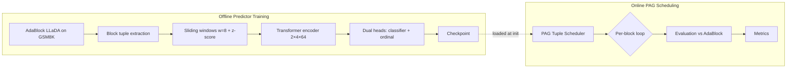
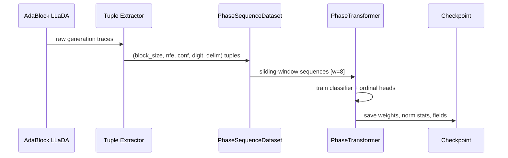
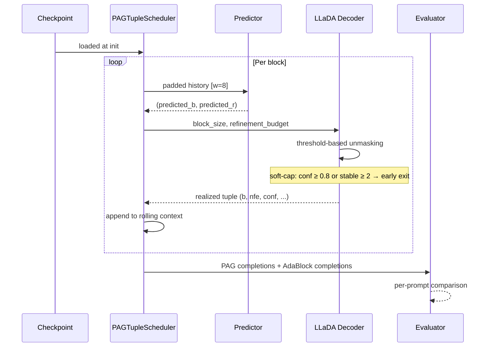

# Architecture

## Two-Track System

## Integration Sequence

### Predictor Training

### PAG Scheduling Loop

## Notes

- The training and inference tracks share the same `phase_predict` module.
- The checkpoint is the only artifact that crosses the train/inference boundary.
- The `src/pag/` pipeline provides a structured experimentation skeleton with typed contracts and swappable implementations, running parallel to the offline tools.
