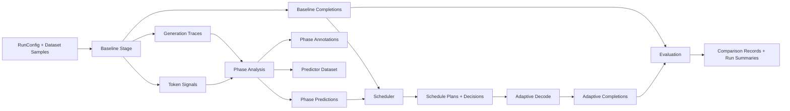
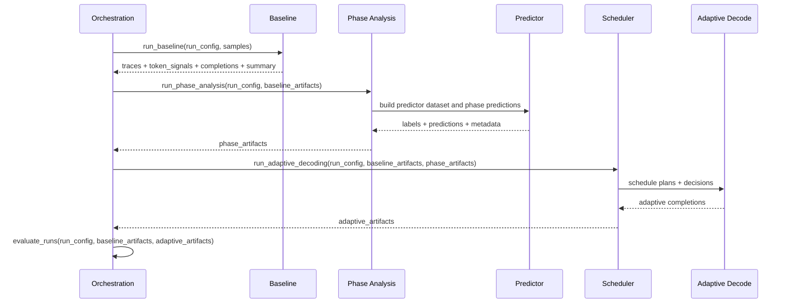

# Architecture

## Pipeline workflow

## Integration sequence

## Notes

- The contracts package defines the only shared data shapes that all teams must honor.
- Module internals remain intentionally unconstrained.
- Each stage entrypoint accepts an optional implementation callable, so teams can swap internals without changing orchestration.
