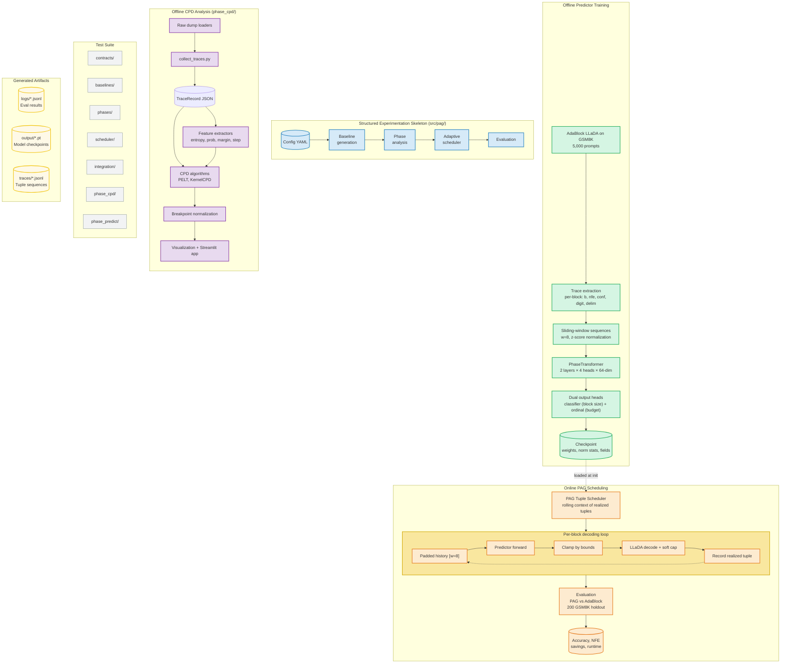

# Phase-Adaptive Generation (PAG) — Workflow Diagram

## Two-Track Architecture

## Summary

| Layer | Purpose | Key Directories |
|-------|---------|----------------|
| **Training** | Extract block tuples from AdaBlock traces, train Transformer predictor | `phase_predict/`, `AdaBlock-dLLM/` |
| **Inference** | Load checkpoint, schedule per-block refinement with soft-cap | `AdaBlock-dLLM/llada/`, `AdaBlock-dLLM/dream/` |
| **Skeleton** | Formal 4-stage pipeline with typed contracts and swappable implementations | `src/pag/` |
| **CPD Analysis** | Offline change-point detection for trace interpretability | `phase_cpd/` |
| **Artifacts** | Traces, checkpoints, logs generated by the system | `traces/`, `output/`, `logs/` |
