# Phase-Adaptive Generation (PAG) — Workflow Diagram

```mermaid
flowchart TB
    subgraph Config["Configuration Layer"]
        RC[("Run Configs<br/>(configs/runs/)")]
        DC[("Decoding Configs<br/>(configs/decoding/)")]
        MC[("Model Configs<br/>(configs/model/)")]
        PC[("Predictor Configs<br/>(configs/predictor/)")]
        SC[("Scheduler Configs<br/>(configs/scheduler/)")]
        EC[("Eval Configs<br/>(configs/evaluation/)")]
        DS[("Dataset Samples<br/>(configs/datasets/)")]
    end

    subgraph Probes["Probe Scripts — Trace Collection"]
        PL1["probe_llada.py<br/>Single-prompt LLaDA-8B"]
        PL2["probe_llada_countdown.py<br/>Batch LLaDA-8B on Countdown"]
        PD1["probe_dream.py<br/>Single-pass DREAM-7B"]
        PD2["probe_dream_countdown.py<br/>Batch DREAM-7B on Countdown"]
    end

    subgraph CPD["Offline CPD Analysis (phase_cpd/)"]
        IMP["importers/<br/>Raw dump loaders"]
        CT["collect_traces.py<br/>Convert dumps → TraceRecord"]
        FEAT["features.py<br/>Feature extractors<br/>(entropy, prob, margin, step)"]
        CPD_ALGO["cpd.py<br/>Change-point detection<br/>(PELT, KernelCPD)"]
        SEG["segments.py<br/>Breakpoint normalization"]
        VIZ["visualize.py<br/>Altair chart helpers"]
        APP["app.py<br/>Streamlit interactive explorer"]
        SD["scheduler_dataset.py<br/>Build training rows"]
        EXPORT["export_scheduler_dataset.py<br/>Export JSONL"]
        TRACE_DATA[("TraceRecord JSON<br/>phase_cpd/data/")]
    end

    subgraph Predictor["Phase Predictor (phase_predict/)"]
        DU["data_utils.py<br/>Extract PhaseTuples<br/>from TraceRecords"]
        DSET["dataset.py<br/>PhaseSequenceDataset<br/>(sliding-window)"]
        MODEL["model.py<br/>PhaseTransformer<br/>(Transformer encoder + reg head)"]
        TRAIN["train.py<br/>Training loop, early stopping"]
        PREDICT["predict.py<br/>Inference, load checkpoint"]
        CKPT[("Checkpoints<br/>output/*.pt")]
        TUPLE_DATA[("PhaseTuple JSONL<br/>traces/phase_tuples_*.jsonl")]
    end

    subgraph Pipeline["Core Pipeline (src/pag/)"]
        LOAD["config/loader.py<br/>LoadRunConfig + Samples"]
        
        subgraph Stage1["Stage 1: Baseline"]
            B1["baselines/stubs.py<br/>run_baseline()"]
            B_OUT(("BaselineRunArtifacts<br/>traces, token_signals,<br/>completions"))
        end

        subgraph Stage2["Stage 2: Phase Analysis"]
            P1["phases/stubs.py<br/>run_phase_analysis()"]
            P_OUT(("PhaseArtifacts<br/>annotations, predictions,<br/>predictor_dataset"))
        end

        subgraph Stage3["Stage 3: Adaptive Scheduling"]
            S1["scheduler/stubs.py<br/>run_adaptive_decoding()"]
            S_OUT(("AdaptiveRunArtifacts<br/>decisions, plans,<br/>adaptive_results"))
        end

        subgraph Stage4["Stage 4: Evaluation"]
            E1["evaluation/stubs.py<br/>evaluate_runs()"]
            E_OUT(("EvaluationArtifacts<br/>records, summary"))
        end

        ORCH["orchestration/pipeline.py<br/>run_pipeline()"]
        CLI["orchestration/cli.py<br/>CLI entry point"]
    end

    subgraph Scripts["Pipeline Runner Scripts"]
        RP["run_pipeline.py<br/>Full pipeline"]
        RB["run_baseline.py<br/>Baseline only"]
        RPA["run_phase_analysis.py<br/>Phase analysis only"]
        RA["run_adaptive.py<br/>Adaptive only"]
        EVAL["evaluate_runs.py<br/>Evaluation only"]
        BPD["build_predictor_dataset.py<br/>→ phases"]
        TP["train_phase_predict.py<br/>Train PhaseTransformer"]
        RPPT["run_phase_predict_test.py<br/>Test checkpoint"]
    end

    subgraph Tests["Test Suite (tests/)"]
        T_CONT["contracts/"]
        T_BASE["baselines/"]
        T_PHASE["phases/"]
        T_SCHED["scheduler/"]
        T_INT["integration/"]
        T_CPD["phase_cpd/"]
        T_PRED["phase_predict/"]
    end

    subgraph Outputs["Generated Artifacts"]
        LOGS[("logs/*.jsonl<br/>Eval results")]
        CKPT_OUT[("output/*.pt<br/>Model checkpoints")]
        TRACES[("traces/*.jsonl<br/>Tuple sequences")]
    end

    %% Probe → CPD flow
    Probes --> CT
    IMP --> CT
    CT --> TRACE_DATA
    TRACE_DATA --> FEAT
    TRACE_DATA --> CPD_ALGO
    FEAT --> CPD_ALGO
    CPD_ALGO --> SEG
    SEG --> SD
    SEG --> VIZ
    SEG --> APP
    SD --> EXPORT

    %% CPD → Predictor flow
    TRACE_DATA --> DU
    SD --> DU
    DU --> TUPLE_DATA
    TUPLE_DATA --> DSET
    DSET --> MODEL
    MODEL --> TRAIN
    TRAIN --> CKPT
    CKPT --> PREDICT

    %% Predictor → Pipeline flow
    PREDICT -.-> P1
    CKPT -.-> P1

    %% Config → Pipeline flow
    Config --> LOAD

    %% Pipeline internal flow
    LOAD --> Stage1
    Stage1 --> B_OUT
    B_OUT --> Stage2
    Stage2 --> P_OUT
    B_OUT --> Stage3
    P_OUT --> Stage3
    Stage3 --> S_OUT
    B_OUT --> Stage4
    S_OUT --> Stage4
    Stage4 --> E_OUT

    %% Orchestration
    CLI --> LOAD
    LOAD --> ORCH
    ORCH --> Stage1
    ORCH --> Stage2
    ORCH --> Stage3
    ORCH --> Stage4

    %% Scripts → Pipeline + Predictor
    Scripts --> ORCH
    Scripts --> TRAIN
    Scripts --> PREDICT

    %% Pipeline → Outputs
    Stage1 --> TRACES
    Stage4 --> LOGS
    PREDICT --> CKPT_OUT

    %% Tests
    Tests -.-> Pipeline
    Tests -.-> CPD
    Tests -.-> Predictor

    %% Styles
    classDef config fill:#e1d5e7,stroke:#9673a6,stroke-width:2px
    classDef probe fill:#d4e6f1,stroke:#2980b9,stroke-width:2px
    classDef cpd fill:#d5f5e3,stroke:#27ae60,stroke-width:2px
    classDef predictor fill:#fdebd0,stroke:#e67e22,stroke-width:2px
    classDef pipeline fill:#fadbd8,stroke:#c0392b,stroke-width:2px
    classDef stage fill:#f5b7b1,stroke:#c0392b,stroke-width:1px
    classDef script fill:#d6eaf8,stroke:#2e86c1,stroke-width:2px
    classDef test fill:#f2f3f4,stroke:#7f8c8d,stroke-width:1px
    classDef output fill:#fef9e7,stroke:#f1c40f,stroke-width:2px
    classDef data fill:#f9e79f,stroke:#d4ac0d,stroke-width:2px

    class RC,DC,MC,PC,SC,EC,DS config
    class PL1,PL2,PD1,PD2 probe
    class IMP,CT,FEAT,CPD_ALGO,SEG,VIZ,APP,SD,EXPORT cpd
    class DU,DSET,MODEL,TRAIN,PREDICT predictor
    class LOAD,ORCH,CLI pipeline
    class B1,P1,S1,E1 stage
    class RP,RB,RPA,RA,EVAL,BPD,TP,RPPT script
    class T_CONT,T_BASE,T_PHASE,T_SCHED,T_INT,T_CPD,T_PRED test
    class LOGS,CKPT_OUT,TRACES output
    class B_OUT,P_OUT,S_OUT,E_OUT,TRACE_DATA,TUPLE_DATA,CKPT data
```

## Summary

| Layer | Purpose | Key Directories |
|-------|---------|----------------|
| **Config** | YAML-driven run/model/decoding/eval configuration | `configs/` |
| **Probe Scripts** | Run real diffusion models to collect raw traces | `scripts/probe_*` |
| **CPD Analysis** | Offline change-point detection to identify phase boundaries in traces | `phase_cpd/` |
| **Phase Predictor** | Transformer-based model to forecast next (block_size, refinement_steps) | `phase_predict/` |
| **Pipeline** | Stage-based orchestration: Baseline → Phases → Scheduler → Evaluation | `src/pag/` |
| **Runner Scripts** | Thin CLI wrappers for each pipeline stage + training | `scripts/run_*`, `train_*` |
| **Tests** | Per-stage + integration test suite | `tests/` |
| **Artifacts** | Traces, checkpoints, logs generated by the system | `traces/`, `output/`, `logs/` |
